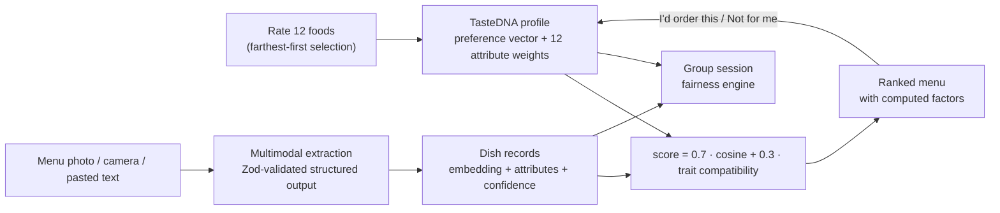

# TasteDNA

**Your palate, decoded.** TasteDNA learns your food preferences from a dozen ratings, turns them into a mathematical taste profile, and ranks every dish on a photographed or pasted menu *for you specifically* — with a computed, auditable reason behind every score.

Then it does the hard version: **it seats a group of people with conflicting palates at one table and picks the restaurant where nobody loses** — and if the call is close, it tells you the one question that would settle it.

🔗 **Live demo:** [taste-dna-seven.vercel.app](https://taste-dna-seven.vercel.app)

| By the numbers | |
| --- | --- |
| Seed foods for onboarding | **46 dishes across 29 cuisines**, actively selected — you only rate 12 |
| Taste representation | **12 interpretable flavor/texture dimensions** + a semantic embedding (64-d local, 1,536-d production) |
| Real campus data | **37 CMU dining venues, 614 real menu items**, ingested through the same pipeline as photographed menus |
| Group fairness | Misery floor + worst-member weighting + **counterfactual decision questions** |
| Verification | **271 tests in 53 files**, plus 5 pgTAP suites against the Postgres row-level-security policies |
| Required configuration to run the demo | **None.** Zero environment variables, zero accounts, zero network calls for the core loop |

---

## For judges: the 90-second path

Everything below works **without signing in and without any API keys**. Nothing in this path can fail on conference Wi-Fi.

| # | Do this | What to notice |
| --- | --- | --- |
| 1 | Click **Discover My Taste** and rate 12 foods | The foods are *actively selected* to be maximally different from each other, not random — see [active learning](#active-learning-why-these-12-foods) |
| 2 | Land on **TasteDNA** | A radar of 12 flavor dimensions, your top cuisines, cooking styles, and representative favorites |
| 3 | Open **Decode a menu** → **Use the sample menu** | Seven dishes extracted into structured records |
| 4 | Read the **ranked results** | Every dish scored 0–100, sorted, with match tiers |
| 5 | Expand any dish | The concrete positive and mismatch factors, and the 70/30 score breakdown. **These are computed from the same numbers that produced the score, not written by a model** |
| 6 | Hit **Not for me** on the top pick | The profile and the entire ranking recompute immediately |

In a hurry? **Try the instant demo** on the landing page loads a seeded 12-rating profile and the sample menu in one click.

To see the group engine, open **Venues** → pick 3–5 → **Start a session**. To see medication screening, open **Meds** → **Example lab**. See [what you can and can't try right now](#what-works-right-now) before demoing multi-account features.

---

## What TasteDNA actually does



### 1. A taste profile learned from 12 ratings

46 curated seed foods span the taste space. You rate ~12. Each rating becomes a signed weight, those weights build a normalized preference vector plus per-dimension attribute preferences, and that becomes your TasteDNA. Cold start returns a neutral 50 rather than faking confidence, and the profile labels itself *early read* / *taking shape* / *well defined* at 0, 10, and 18 ratings.

### 2. Menu extraction from a photo, a camera, or pasted text

Point a phone at a menu. The image is resized and compressed in the browser, validated on the server, and read by a multimodal model that is forced into a strict Zod schema. Malformed output becomes a clean, status-coded UI error, never a stack trace. With no API key configured, a deterministic line-and-keyword parser handles pasted text and a labeled sample fixture handles images — so the demo always works. Details in [menu understanding](#menu-understanding-photo--validated-dish-records).

### 3. Explainable 0–100 rankings with a feedback loop

Every dish gets a Taste Match score, a tier, and an explanation assembled from the *same* strongest positive and negative contributions that produced the score. React with "I'd order this" or "Not for me" and the profile and ranking update immediately.

### 4. Group dining that protects the unhappiest person

A signed-in creator picks 3–5 real campus venues with digitized menus, invites friends, and everyone privately sets meal-only preferences ("something light", "nothing with cilantro", "under $15") that never touch their standing profile. The server computes a fair group recommendation and — when the decision is fragile — **the single question most likely to change the answer**. Full details in [the fairness engine](#the-fairness-engine).

### 5. Medication-aware dining

Add a medication list and the app screens the current menu against curated, source-cited food-interaction rules *before* taste ranking, and renders an interactive medicine → food term → dish map. Every finding carries its source and evidence; unsupported medicines stay visibly unverified. **The list never leaves your browser tab.** See [medication screening](#medication-screening).

---

## The taste engine

Each dish has two complementary representations:

- **A semantic embedding** of its normalized text — name, description, cuisine, ingredients, the flavor/texture traits scoring ≥ 0.55, proteins, bases, and cooking methods. `EmbeddingProvider` makes the backend swappable: demo mode uses a **deterministic local projection** (FNV-1a hashing of unigram and bigram tokens into 64 signed buckets, then L2-normalized — identical text always yields the identical vector, with no network); production uses 1,536-dimensional `text-embedding-3-small` stored in pgvector.
- **Twelve interpretable 0–1 attributes** — sweet, salty, sour, bitter, umami, spicy, rich, fresh, crispy, creamy, chewy, smoky — plus categorical cuisine, ingredient, protein, carbohydrate, and cooking-method data.

A rating converts once through `ratingToWeight`:

```text
1 → -1.0    2 → -0.5    3 → 0    4 → +0.5    5 → +1.0
```

For rated dishes with embedding `eᵢ`, attributes `aᵢ`, and weight `wᵢ`:

```text
userVector     = normalize(Σ wᵢ · eᵢ)
attributePrefs = (Σ wᵢ · aᵢ) / Σ |wᵢ|                       (per dimension, in [-1, 1])

semantic       = cosineSimilarity(userVector, dish.embedding)
structured     = clamp(Σ_d attributePrefs[d] · dish[d]  /  Σ_d |attributePrefs[d]|, -1, 1)
rawScore       = 0.70 × semantic + 0.30 × structured
Taste Match    = round(clamp((rawScore + 1) × 50, 0, 100))
```

Negative ratings matter as much as positive ones: a 1-star pushes the vector *away* from that dish. Cuisine and cooking-method preferences are tracked the same way, as mean signed weight per category.

**Explanations are a by-product of scoring, not a second model call.** The per-dimension products `attributePrefs[d] · dish[d]` are the structured score's own terms; the top three positive and top two negative terms above a 0.015 threshold become the "leans umami, rich" / "the sweet notes may be less aligned" factors you see in the UI, with favorite cuisine and cooking method appended when they contribute. The 70/30 split lives in `src/lib/taste/constants.ts`.

**Scoring is deterministic** — identical inputs always produce identical output, which is what makes the explanations trustworthy and the whole engine testable without mocks.

### Active learning: why these 12 foods?

Onboarding uses a **farthest-first selector** (`src/lib/taste/active-learning.ts`): it repeatedly picks the unrated candidate whose *minimum* cosine distance to everything already shown or rated is largest. Twelve ratings therefore cover the taste space instead of showing you ten variations on the same dish. Because it re-anchors on your existing ratings, returning users get new foods that fill gaps in their profile.

### Offline evaluation harness

`src/lib/recommendation/evaluation.ts` implements a leakage-free held-out protocol: for each user, the latest positive and latest negative rating are held out, the profile is rebuilt from the rest, and the ranker is scored on **Hit@1, Hit@3, NDCG@3, mean reciprocal rank, and pairwise accuracy** (does the liked dish outrank the disliked one?). Candidates seen in training are excluded from the ranked list. This is how we'd measure any future model swap against the current cosine baseline instead of eyeballing it.

---

## The fairness engine

Picking a restaurant for a group is not "average everyone's score." Averaging lets a majority steamroll one person. TasteDNA scores in three stages and explicitly protects the worst-off member.

```mermaid
flowchart TB
  subgraph per member, per venue
    P["Standing TasteDNA score"] --> U["dish utility<br/>0.75 · profile + 0.25 · meal context<br/>hard exclusions → utility 0"]
    C["Tonight's tags + exclusions"] --> U
    U --> V["venue utility<br/>0.7 · best dish + 0.3 · mean of top 3"]
  end
  V --> G["group score<br/>0.65 · mean + 0.35 · worst member"]
  G --> F{"worst member ≥ 45<br/>(misery floor)?"}
  F -- "some venues clear it" --> W["rank floor-clearers → winner"]
  F -- "none clear it" --> K["best compromise,<br/>flagged compromiseRequired"]
  W --> Q{"margin ≤ 7?"}
  K --> Q
  Q -- "fragile" --> D["simulate every unanswered question<br/>surface the one that flips the result"]
  Q -- "safe" --> E["explanation facts"]
```

**Stage 1 — dish utility, per person** (`src/lib/recommendation/meal-utility.ts`). Blends the standing taste profile with tonight's context:

```text
dishUtility = 0.75 × persistentTasteScore + 0.25 × mealContextScore
```

Meal context comes from the tags each member set for *this meal only* — `spicy`, `light`, `comforting`, `filling`, `cheap`, `quick` — each mapped onto the dish's attribute vector (e.g. *light* = mean of `fresh`, `1 − rich`, `1 − creamy`; *cheap* scales against a $12 reference). "Avoid" tags invert the signal. Hard exclusions for ingredients, protein types, and a price ceiling drop the dish entirely with a recorded reason. Missing data yields *no* adjustment rather than a guessed one.

**Stage 2 — restaurant utility, per person.** A venue is only as good as what you'd actually order, with a nod to having options:

```text
memberUtility = 0.7 × bestDishUtility + 0.3 × meanOfTopThreeDishes
```

**Stage 3 — group score, with a misery floor** (`src/lib/group/ranking.ts`).

```text
groupScore = 0.65 × groupMean + 0.35 × worstMemberUtility
```

Any venue where the worst-off member falls below a **misery floor of 45** is disqualified. The group only falls back to those venues when *no* option clears the floor, and the result is then flagged `compromiseRequired` so the UI says so out loud. Ties break on worst-member utility, then on the creator's candidate order, so the ranking is fully deterministic. Weights live in `GROUP_RANKING_WEIGHTS`.

Every result ships with typed **explanation facts** — winner advantage, worst-member protection, runner-up gap, which venues failed the floor, and each member's best available dish — derived only from the ranking intermediates. The UI renders those values; nothing is paraphrased by a model.

### The part we're proudest of: decision questions

After ranking, the engine (`src/lib/group/decision.ts`) measures how fragile the win is — the margin between the winner and the runner-up among venues that were eligible to win:

| Margin | Confidence |
| --- | --- |
| ≤ 7 points, or a forced compromise | **low** |
| < 15 points | **medium** |
| ≥ 15 points | **high** |

When confidence is low, TasteDNA runs a **counterfactual search**: for every member and every meal tag they haven't answered, it simulates both a "yes" and a "no" through the real ranking pipeline and measures the impact — the change in winner margin, plus a large bonus (1,000) if the winner flips. The single highest-impact question is surfaced. Instead of "here's your restaurant, trust us," the group gets: *"This one was close — Priya, would you like something light for this meal?"* One answer, recomputed, decided.

Every computation is persisted with an algorithm version (`fair-group-v1.0.0`) and a **SHA-256 hash of its canonicalized inputs** (keys sorted recursively), so results are reproducible, cacheable, and attributable to the exact engine revision that produced them.

### Privacy inside a group

The server loads private member profiles to compute, then returns **only the derived result**. Another member's ratings, profile JSON, and meal-preference JSON are never sent to your browser. Only the creator can trigger a recompute; only accepted friends can be invited; invitees must accept before they can check in.

---

## Menu understanding: photo → validated dish records

The extraction pipeline (`src/lib/menu/`, `src/app/api/menu/extract/`) is built so the model can only fill a shape we define.

**Client side.** Images are decoded with EXIF orientation respected, downscaled to a 1,920 px long edge at quality 0.86, and re-encoded whenever they exceed that size or 2.5 MB. Source files up to 30 MB are accepted; uploads are capped at 8 MB.

**Server side.** MIME allowlist (JPEG/PNG/WebP/HEIC), size caps, and a 25,000-character limit on pasted text. The model is called through the Responses API with **`zodTextFormat` structured output** — the same `extractedMenuModelSchema` that validates the response: up to 80 dishes, each with name, description, nullable price, category, cuisine, ≤ 20 ingredients, all twelve 0–1 scores, protein/carb/method lists, a `confidence` value, and an `unknownFields` list. The system prompt forbids inventing dishes; uncertain fields must be declared rather than guessed. Requests run with `store: false`, a prompt-cache key, zero SDK retries, and a 30 s timeout.

**Failure handling.** A primary model is tried first; a fallback model runs *only* when the primary produced an unusable result. Failures are classified (`empty_menu`, `invalid_structured_output`, `rate_limit`, `timeout`, `request_failed`) and mapped to specific HTTP statuses (429 / 504 / 422 / 502) with actionable messages.

**No key? Still works.** Pasted text goes through a deterministic parser that recognizes section headings, trailing prices, and `name – description` separators, then infers attributes from keywords. Photos return a clearly labeled sample fixture. `TASTEDNA_DEMO_MODE=true` forces this path even with a key.

### Real campus menus, same pipeline

The **Venues** map is backed by real data, not lorem ipsum:

- `src/lib/cmu-dining/` syncs venue metadata from the CMU Eats feed on demand (never on page load), with **content-hash change detection** so unchanged rows aren't rewritten and a checked-in last-good snapshot that can seed an empty database but **never overwrites live data**.
- `scripts/ingest-cmu-menus.ts` ingests a compiled dataset of **37 restaurants and 614 real menu items**. Because that dataset contains only item *names*, it runs a separate, explicitly-labeled enrichment step (batches of 25) that infers descriptions and attributes — every resulting dish carries reduced confidence and `"description"` in `unknownFields`, so the UI keeps showing it as inferred rather than observed. The production photo extractor is a different prompt that is *forbidden* from inferring anything. The script is resumable: venues already carrying a current dataset menu are skipped, and a failed transaction reports the underlying Postgres error.
- Enriched dishes are embedded in the **same deterministic space** the browser uses for your profile, so a client-side TasteDNA scores server-side venue menus without any translation layer.
- Shared menus are **versioned per venue** with validity windows; `/api/venues` serves the newest valid version and labels it *fresh* or *stale* against a 30-day threshold. Ingestion goes through a single Postgres transaction (`ingest_shared_menu`).

---

## Medication screening

`src/lib/medications/` is a deliberately conservative, fully deterministic layer that runs *before* taste ranking and never modifies taste scores.

- A **versioned rule catalog** with drug-specific formulations, aliases, severity, evidence, and dated authoritative sources (DailyMed / MedlinePlus). Current coverage: simvastatin, fexofenadine, linezolid, and tacrolimus capsules — chosen because their food guidance is label-explicit.
- **Phrase-boundary matching** on the extracted name, description, and ingredient text only. Cuisine, taste dimensions, embeddings, and AI confidence are never used to infer an interaction. Qualified or negated mentions produce *review* findings, not assertions.
- Results are grouped **No listed match → Needs review → Label warning**; taste ordering is preserved within groups.
- An interactive graph (`map.ts`) connects medicines → food terms → dishes. Every path retains its rule owner, matched term, and evidence; shared ingredient nodes never imply drug–drug interactions.
- The list lives in account-scoped **`sessionStorage`** — never in Supabase, shared menus, group payloads, or model prompts.

"No listed match" describes only the covered rules and the extracted text; the UI says so. Full coverage, limitations, and the verification checklist are in [docs/MEDICATION_CHECKS.md](docs/MEDICATION_CHECKS.md).

---

## Platform and data model

Anonymous users get the full solo flow from a single `localStorage` key. Signing in (password or magic link via Supabase Auth) moves ratings and the derived profile behind owner-only row-level security.

**Schema** (`supabase/migrations/`, 6 migrations): users, dishes with `vector(1536)` embeddings, dish features, ratings, taste profiles, menus and menu items, venues, friendships, group sessions/members/candidates/meal preferences, and versioned group recommendation results.

**Security model.**

- **RLS on every table.** Session rosters, candidates, and results are readable only by accepted members; meal-preference rows are readable only by their owner.
- **State machines in triggers.** `guard_friendship_transition` and `guard_group_member_transition` reject invalid status changes at the database layer, so no API bug can skip a step.
- **Privileged operations as SQL functions**, not ad-hoc multi-statement writes: `create_group_session` (atomic session + creator membership + candidates), `replace_group_session_candidates`, `persist_group_recommendation`, `request_friendship_by_email`, and `ingest_shared_menu`.
- **No email enumeration.** Friend requests return the same neutral `202` whether the request was created, already existed, or the address is unknown.
- **Server-only secrets.** The secret key is used exclusively in route handlers behind the `src/lib/db/` boundary and is never exposed through a `NEXT_PUBLIC_` variable.

Each of the five later migrations ships with a **pgTAP test suite** (`supabase/tests/database/`) that asserts the functions exist and the policies behave as intended for owners, members, and outsiders.

---

## What works right now

Honest status, so nothing surprises you in a live demo.

| Capability | Status |
| --- | --- |
| Rate foods → TasteDNA profile → decode menu → ranked results → feedback | ✅ Fully working, no account or keys needed |
| Instant demo (seeded profile + sample menu) | ✅ Working, zero network calls |
| Medication screening and interaction map | ✅ Working, no account needed |
| Menu extraction from pasted text | ✅ Working without an API key |
| Menu extraction from a photo | ✅ With `OPENAI_API_KEY`; falls back to a labeled sample fixture without one |
| Campus venue browsing and map | ✅ Working; falls back to a labeled cached snapshot if the database is unreachable |
| Real CMU venue menus in the database | ✅ 37 venues ingested from the compiled dataset |
| Group fairness engine and decision questions | ✅ Implemented, unit-tested, and wired to live API routes end to end |
| **Friend requests and multi-person group sessions** | ⚠️ **Currently unavailable live** — see below |

**About friendships.** The friendship and group-session backends are built, migrated, and tested, and the UI calls the real endpoints. What's blocking live multi-account use is Supabase auth email delivery hitting provider rate limits, so test accounts can't complete confirmation. The consequence for a judge: you can explore the group UI and the engine's output, but you can't currently add a second real account to a session. The fairness math itself is exercised by `src/lib/group/ranking.test.ts`, `src/lib/group-sessions/compute.test.ts`, and `src/components/group/result-helpers.test.ts`.

We'd rather flag this than have you discover it mid-demo.

---

## Engineering practices worth noticing

- **Domain math is framework-free.** `src/lib/taste`, `recommendation`, `group`, and `medications` import no React and no service clients. The entire recommendation engine is unit-tested with plain fixtures — no database, no network, no mocking framework.
- **Determinism everywhere it matters.** Embeddings, scoring, ranking, tie-breaks, explanations, medication matching, and group recommendations are all pure functions of their inputs, and results are stored with an input hash to prove it.
- **Honest uncertainty is a first-class value.** Inferred fields are recorded as such, thin rating history is labeled an early read, unverified medications stay visibly unverified, demo fallbacks are labeled in the UI, and every explanation maps back to a computed factor rather than generated prose.
- **Validation at every boundary.** Zod schemas on model output, API inputs, persisted profiles, and group-session route contracts.
- **Typed contracts shared across the team.** `src/types/` holds the domain interfaces; `src/types/group.fixtures.ts` provides canonical scenarios used by both engine and UI tests.

```bash
npm test     # 271 tests across 53 files
npm run lint
npm run build
```

The suite covers rating transformation, vector normalization, cosine similarity, taste-vector generation, attribute preferences, cold start, candidate scoring, deterministic ranking, the evaluation harness, meal utility, group fairness ranking, decision-question generation, group-session compute and hashing, medication screening and graph paths, friendship and group-session repositories and HTTP contracts, menu extraction, image optimization, shared-menu normalization and selection, CMU dining sync, and page-level integration flows.

---

## Architecture

One strict TypeScript Next.js 16 / React 19 repository. Tailwind 4, Recharts for the profile radar, Leaflet for the campus map, Zod 4 for every schema, Supabase (Postgres + pgvector + Auth) for persistence, Vitest for tests.

```text
src/
├── app/
│   ├── api/
│   │   ├── menu/extract/       # Validated multimodal extraction endpoint
│   │   ├── venues/             # Campus venues + newest valid shared menu
│   │   ├── friendships/        # Request / accept / reject
│   │   ├── group-sessions/     # Sessions, invitations, candidates,
│   │   │                       #   meal preferences, recommendation
│   │   └── admin/cmu-dining/   # Manual upstream dining sync
│   ├── onboarding/             # Active-learning rating flow
│   ├── dashboard/              # TasteDNA profile + Recharts radar
│   ├── decode/                 # Image capture / upload / paste
│   ├── results/                # Ranking, explanations, feedback
│   ├── venues/                 # Leaflet campus map + candidate picker
│   ├── sessions/               # Group room and group results
│   ├── medications/            # Medication workspace
│   └── friends/, sign-in/      # Accounts and social
├── components/
│   ├── group/                  # Group results, decision question card
│   ├── map/                    # Campus map, venue cards, selection rules
│   ├── medications/            # Interaction explorer and list editor
│   ├── providers/              # Session → Taste → Medication composition
│   ├── recommendation/         # Expandable result cards
│   └── taste/, ui/, layout/
├── lib/
│   ├── taste/                  # Seed foods, rating math, profiles, active learning
│   ├── recommendation/         # Candidate scoring, explanations, meal utility, evaluation
│   ├── group/                  # Fairness ranking and decision questions
│   ├── group-sessions/         # Session repository, HTTP client, compute + hashing
│   ├── friendships/            # Friendship repository and client
│   ├── medications/            # Rule catalog, deterministic screening, graph
│   ├── menu/                   # Extraction schema, processing, shared menus
│   ├── embeddings/             # Swappable providers + text normalization
│   ├── cmu-dining/             # Upstream feed normalization, sync, cache
│   └── db/, auth/              # Supabase client boundary and auth adapters
└── types/                      # Shared domain contracts + group fixtures

scripts/                        # CMU menu ingestion + enrichment
supabase/migrations/            # PostgreSQL + pgvector schema, RLS, RPCs
supabase/tests/database/        # pgTAP policy tests
```

**Layering rule:** external service code stays behind its existing client/server boundary, and recommendation math never enters a React component.

---

## Run it locally

Requirements: Node.js 22+ and npm. **No environment values are required** — the full solo flow, the medication explorer, and the instant demo all run on a bare checkout.

```bash
npm install
cp .env.example .env.local   # PowerShell: Copy-Item .env.example .env.local
npm run dev
```

Open <http://localhost:3000>.

### Optional configuration

| Variable | Unlocks |
| --- | --- |
| `OPENAI_API_KEY` | Live multimodal menu extraction from photos |
| `OPENAI_MENU_MODEL` / `OPENAI_MENU_FALLBACK_MODEL` / `OPENAI_MENU_TIMEOUT_MS` | Model and timeout overrides; the fallback runs only after an unusable primary result |
| `NEXT_PUBLIC_SUPABASE_URL`, `NEXT_PUBLIC_SUPABASE_PUBLISHABLE_KEY` | Accounts, persisted profiles, friendships, group sessions |
| `SUPABASE_SECRET_KEY` | Server-only. Shared-menu persistence and privileged lookups. **Never** expose behind `NEXT_PUBLIC_` |
| `CMU_DINING_API_URL`, `CMU_DINING_SYNC_SECRET` | Manual campus dining sync; ordinary page loads never call upstream |
| `TASTEDNA_DEMO_MODE=true` | Forces fallback extraction even with a key configured |

To load the real campus menus into a configured Supabase project: `npx tsx scripts/ingest-cmu-menus.ts --dry-run` prints the plan offline; drop `--dry-run` to enrich and store. Full setup notes for Supabase (migrations, redirect URLs, magic-link vs. password flows) are in the [team docs](docs/team/README.md).

---

## Why this is more than a wrapper

Six ideas composed into one explainable loop:

- **Semantic food embeddings** capture relationships that exact ingredient matching misses.
- **Interpretable structured features** keep flavor, texture, cuisine, and cooking signals visible rather than buried in a vector — and double as the explanation.
- **Preference-vector learning** turns positive *and negative* ratings into a personal direction, with an offline evaluation harness to measure it.
- **Fairness-adjusted group ranking** with an explicit misery floor, instead of an average that lets majorities win.
- **Counterfactual decision questions** that simulate every unanswered preference and surface the one answer most likely to change the outcome.
- **Schema-constrained multimodal extraction** that turns a photograph into validated dish records — and a real-campus data pipeline that feeds the same engine.

The model reads menus. Everything that decides, ranks, explains, and protects is math you can read in `src/lib/`.

---

## Team ownership

Three areas developed in parallel without file contention:

- **Product & UI** — `src/app/`, `src/components/`
- **Taste & ranking** — `src/lib/taste/`, `src/lib/recommendation/`, `src/lib/embeddings/`, `src/lib/group/`
- **Menu, API & data** — `src/lib/menu/`, `src/app/api/`, `src/lib/db/`, `src/lib/cmu-dining/`, `supabase/`, `scripts/`

Shared contracts live in `src/types/`. Contributor handoffs and per-task notes are in [docs/team/](docs/team/README.md).
